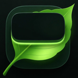
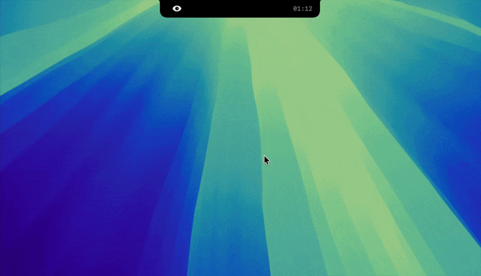

<h1 align="center">
  <br>
  
  <br>
  NudgeNotch
  <br>
</h1>

<p align="center">
<a href="https://github.com/suryanshkushwaha/nudge.notch/releases/download/v0.3.0/nudgeNotch.dmg" target="_self"></a>
  <a href="https://suryanshkushwaha.com/support">
    
  </a>
</p>

Say hello to **NudgeNotch**, your eye-care reminder that lives in the MacBook notch! NudgeNotch helps you reduce eye strain by gently reminding you to blink and look away at regular intervals, right where you can’t miss it. The notch transforms into a dynamic visual cue, complete with a blinking eye animation, 20-20-20 rule look away reminders, and customizable settings.

<p align="center">
  
</p>

---

## Installation

**System Requirements:**

- macOS **14 Sonoma** or later
- Apple Silicon or Intel Mac

---

### Download and Install Manually

<a href="https://github.com/suryanshkushwaha/nudge.notch/releases/download/v0.3.0/nudgeNotch.dmg" target="_self"></a>

Once downloaded, open the `.dmg` and move **NudgeNotch** to your `/Applications` folder.

> [!IMPORTANT]
> I don't have an Apple Developer account (yet 👀), so macOS will warn you that nudgeNotch is from an unidentified developer on first launch. This is expected behavior.
>
> You'll need to bypass this before the app will open. You only need to do this once. Use one of the methods below.

---

#### Recommended: Terminal (Always Works)

This is the fastest and simplest method. It requires just one command and works reliably for all users, unlike System Settings, which occasionally doesn't.

After moving nudgeNotch to your Applications folder, run:

```bash
xattr -dr com.apple.quarantine /Applications/nudgeNotch.app
```

Then open the app normally.

---

#### Alternative: System Settings

> [!NOTE]
> This method doesn't work for all users. If this doesn't work, use the Terminal method above.

1. Try to open the app — you'll see a security warning.
2. Click **OK** to dismiss it.
3. Open **System Settings** > **Privacy & Security**.
4. Scroll to the bottom and click **Open Anyway** next to the nudgeNotch warning.
5. Confirm if prompted.

---

## Usage

- Launch the app. The notch will display a subtle eye icon and countdown timer.
- When it’s time to blink or look away, the notch expands and shows a reminder.
- Customize reminder intervals and behavior in the Settings panel.
- Access settings or quit the app via the menu bar icon or notch context menu.

## 📋 Roadmap

- [x] Blink reminder with animated eye
- [x] Customizable interval and duration
- [x] Notch expansion on hover
- [x] Look Away breaks (20-20-20 rule)
- [ ] Water breaks

## Building from Source

### Prerequisites

- **macOS 14 or later**: If you’re not on the latest macOS, we might need to send a search party.
- **Xcode 16 or later**: This is where the magic happens, so make sure it’s up-to-date.

### Installation

1. **Clone the Repository**:

  ```bash
  git clone https://github.com/suryanshkushwaha/nudge.notch.git
  cd nudge.notch
  ```

2. **Open the Project in Xcode**:

  ```bash
  open nudgeNotch.xcodeproj
  ```

3. **Build and Run**:
   - Click the "Run" button or press `Cmd + R`. Watch the magic unfold!

## 🤝 Contributing

We’re all about good vibes and awesome contributions! Read [CONTRIBUTING.md](CONTRIBUTING.md) to learn how you can join the fun!

## Star History

<a href="https://www.star-history.com/#suryanshkushwaha/nudge.notch&type=date&legend=top-left">
 <picture>
   <source media="(prefers-color-scheme: dark)" srcset="https://api.star-history.com/svg?repos=suryanshkushwaha/nudge.notch&type=date&theme=dark&legend=top-left" />
   <source media="(prefers-color-scheme: light)" srcset="https://api.star-history.com/svg?repos=suryanshkushwaha/nudge.notch&type=date&legend=top-left" />
   
 </picture>
</a>

## Support me!

<a href="https://suryanshkushwaha.com/support" target="_blank"></a>